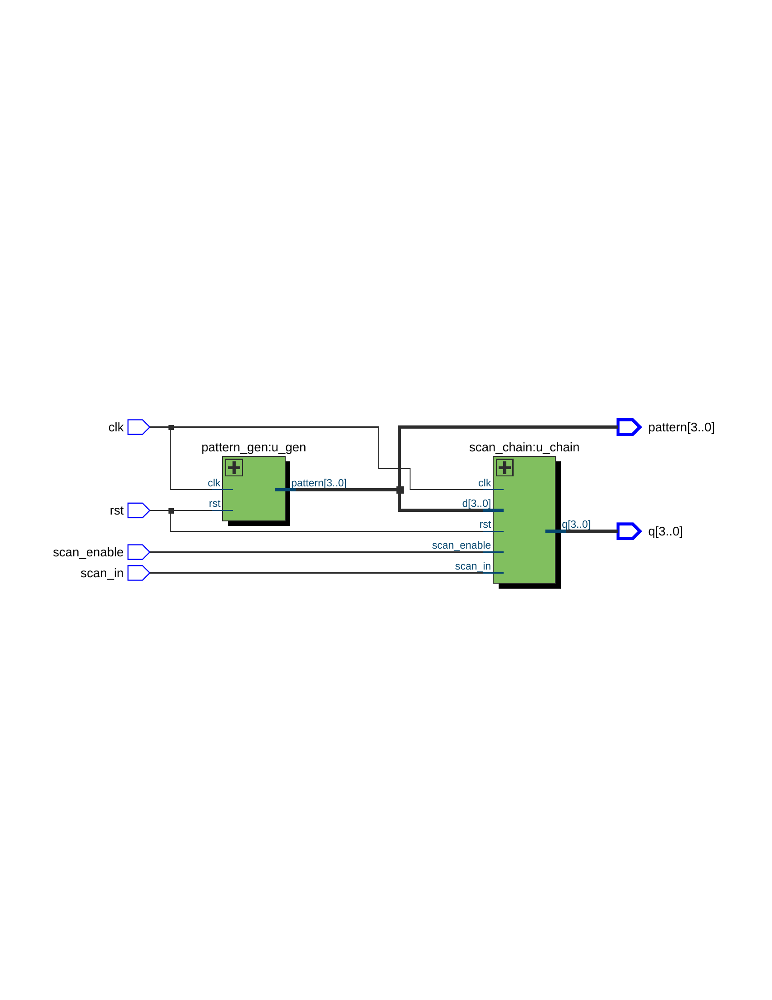
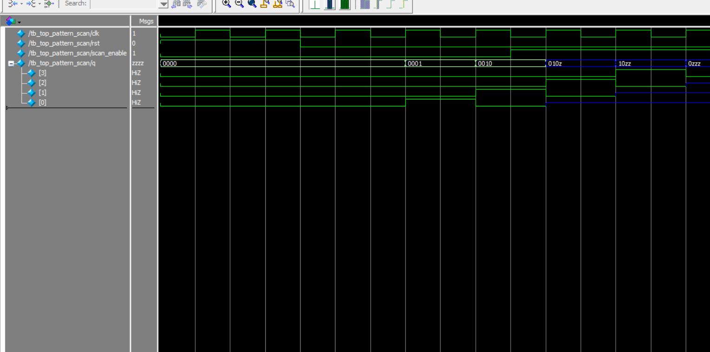

# 🧪 DFT Pattern Scan Project

This project demonstrates a 4-bit scan chain with automatic pattern generation and scan-based data capturing.

---

## 🖼️ RTL Schematic

---

## 📊 Simulation Waveform

---

## 🧰 Toolchain

- Quartus Prime Lite 18.0  
- ModelSim - Intel FPGA Starter Edition 10.5b  

---

## 📁 Folder Structure

| File Name                 | Description                                  |
|--------------------------|----------------------------------------------|
| `scan_dff.v`             | Scan DFF module (reused)                     |
| `scan_chain.v`           | 4-stage scan chain using scan_dff           |
| `pattern_gen.v`          | 4-bit pattern generator                      |
| `top_pattern_scan.v`     | Top module integrating pattern_gen and scan_chain |
| `tb_top_pattern_scan.v`  | Testbench for top module                     |
| `RTL_top_pattern_scan.png` | Quartus RTL schematic                     |
| `wave_tb_top_pattern_scan.png` | ModelSim waveform output            |
---

## ✍️ Author

Huichingchang  
April 2025
